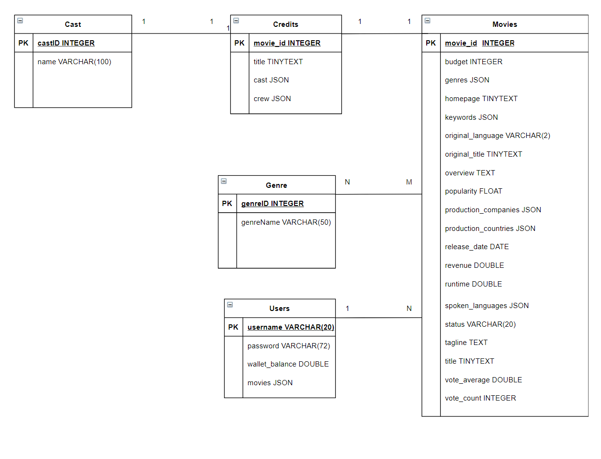

# Movie Service

## Dependencies
| Package  | Version | Maven Link |
| --- | --- | --- |
| Apache Commons Lang | 3.1 | https://mvnrepository.com/artifact/org.apache.commons/commons-lang3/3.1 |
| JBCrypt | 0.4 | https://mvnrepository.com/artifact/org.mindrot/jbcrypt/0.4 |
| JSON Simple | 1.1.1 | https://mvnrepository.com/artifact/com.googlecode.json-simple/json-simple/1.1.1 |
| MySQL Connector - J | 8.0.23 | https://mvnrepository.com/artifact/mysql/mysql-connector-java/8.0.23 |
| OpenCSV | 5.4 | https://mvnrepository.com/artifact/com.opencsv/opencsv/5.4 |

## Resources
| Name  | Link |
| --- | --- |
| Data | https://www.kaggle.com/tmdb/tmdb-movie-metadata |
| Bcrypt Usage | https://gist.github.com/craSH/5217757 |

## Diagram

## Abstract
Exploring the potential use of Movie data in creating a service to buy/filter movies a user may want to watch.

## Contact Me
You can contact me at:
dliu206@uw.edu
